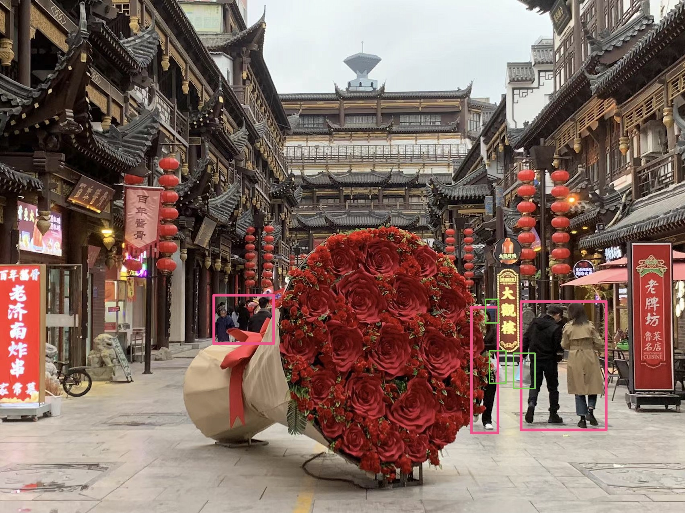

# Inpaint Anything: Segment Anything Meets Image Inpainting
- Authors: Tao Yu, Runseng Feng, Ruoyu Feng, Jinming Liu, Xin Jin, Wenjun Zeng and Zhibo Chen.
- Institutes: University of Science and Technology of China; Eastern Institute for Advanced Study.
- [[Paper](https://arxiv.org/abs/2304.06790)] [[Website](https://huggingface.co/spaces/InpaintAI/Inpaint-Anything)] [[Hugging Face Homepage](https://huggingface.co/InpaintAI)]

TL; DR: Users can select any object in an image by clicking on it. With powerful vision models, e.g., [SAM](https://arxiv.org/abs/2304.02643), [LaMa](https://arxiv.org/abs/2109.07161) and [Stable Diffusion (SD)](https://arxiv.org/abs/2112.10752), **Inpaint Anything** is able to remove the object smoothly (i.e., *Remove Anything*). Further, prompted by user input text, Inpaint Anything can fill the object with any desired content (i.e., *Fill Anything*) or replace the background of it arbitrarily (i.e., *Replace Anything*).

## 📜 News
[2023/5/02] Enabling removing numerous objects while inputing multiple bboxs, hence making it convinient to **P** your pictures!

## <span id="remove-anything">📌 Remove Anything</span>


**Click** on an object in the image, and Inpainting Anything will **remove** it instantly!
- Click on an object;
- [Segment Anything Model](https://segment-anything.com/) (SAM) segments the object out;
- Inpainting models (e.g., [LaMa](https://advimman.github.io/lama-project/)) fill the "hole".

### Installation
Requires `python>=3.8`
```bash
python -m pip install torch torchvision torchaudio
python -m pip install -e segment_anything
python -m pip install -r lama/requirements.txt 
```

### Usage
Download the model checkpoints provided in [segment_anything](./segment_anything/README.md) 
and [lama](./lama/README.md) (e.g. [sam_vit_h_4b8939.pth](https://dl.fbaipublicfiles.com/segment_anything/sam_vit_h_4b8939.pth) 
and [big-lama](https://disk.yandex.ru/d/ouP6l8VJ0HpMZg)), and put them into `./pretrained_models`.

Specify an image and multiple bboxes which you want to erase them, and Inpaint-Anything will remove the object in the area of pre-selected bboxes.
```bash
python remove_OAOA.py \
    --input_img ./example/remove-anything/17331682166557_.pic.jpg \
    --dilate_kernel_size 15 \
    --output_dir ./results \
    --sam_model_type "vit_h" \
    --sam_ckpt ./pretrained_models/sam_vit_h_4b8939.pth \
    --lama_config ./lama_init_bak/configs/prediction/default.yaml \
    --lama_ckpt ./pretrained_models/big-lama \
```

You only need to change `--input_img` to your picture's path, and input the bboxes in the format of <x1, y1, x2, y2> in line 73 of [remove_OAOA.py](remove_OAOA.py#L73).

### Demo
<table>
  <tr>
    <td></td>
    <td></td>
    <td></td>
  </tr>
</table>

## Acknowledgments
- [Segment Anything](https://github.com/facebookresearch/segment-anything)
- [LaMa](https://github.com/advimman/lama)
- [Stable Diffusion](https://github.com/CompVis/stable-diffusion)


 ## Other Interesting Repositories
- [Awesome Anything](https://github.com/VainF/Awesome-Anything)
- [Composable AI](https://github.com/Adamdad/Awesome-ComposableAI)
- [Grounded SAM](https://github.com/IDEA-Research/Grounded-Segment-Anything)

## Citation
If you find this work useful for your research, please cite us:
```
@article{yu2023inpaint,
  title={Inpaint Anything: Segment Anything Meets Image Inpainting},
  author={Yu, Tao and Feng, Runseng and Feng, Ruoyu and Liu, Jinming and Jin, Xin and Zeng, Wenjun and Chen, Zhibo},
  journal={arXiv preprint arXiv:2304.06790},
  year={2023}
}
```
